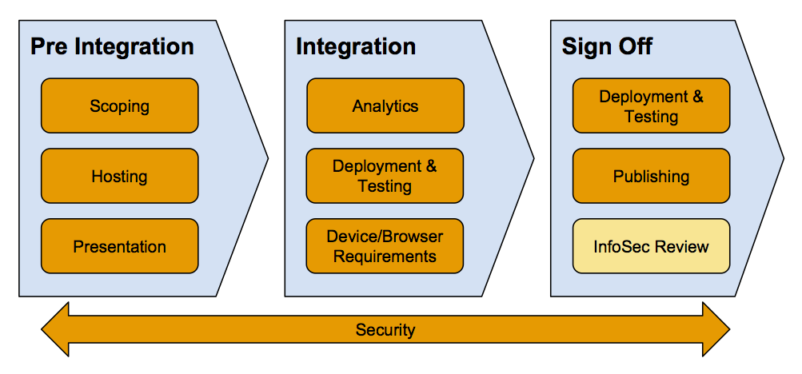

# Taster pilots technical integration documentation

Pilot applications aim to test and validate new ideas through real audience feedback. [BBC Taster](http://www.bbc.co.uk/taster) is a platform that allows the presentation of these pilots to an audience and provides a framework for gathering user feedback.

Pilots applications are typically (but not always) web applications. This documentation gives an overview of the steps you (the pilot author) and the BBC Taster team will go through together, concentrating on the development and deployment activities, to build, deploy and present the pilot in Taster.

## On-boarding Process

Creating and launching your pilot into Taster is a collaborative effort. You will go through the following stages, working with the Taster team throughout 

More detail about the concerns highlighted in the process are given below, including the **actions that must be completed** to satisfy them. 

<table>
    <thead>
        <tr>
            <th></th>
            <th>Taster team actions</th>
            <th>Pilot team actions</th>
            <th>Additional documentation</th>
        </tr>
    </thead>
    <tbody>
        <tr>
            <td>
                
<strong>Scoping</strong>

                
Tell us how your pilot application works and we'll confirm we've understood

                <a href="overview/pilot-description.md">Read more...</a>
            </td>
            <td>
                Advise on:
                <ul>
                    <li>InfoSec requirements</li>
                    <li>Hosting requirements</li>
                    <li>Presentation style</li>
                </ul>
            </td>
            <td>
                <ul>
                    <li>Create an application diagram</li>
                </ul>
            </td>
            <td>
                <ul>
                </ul>
            </td>
        </tr>
        <tr>
            <td>
                
<strong>Presentation</strong>

                
Choose the user journey for presenting the pilot in Taster

                <a href="overview/presentation.md">Read more...</a>
            </td>
            <td>
                <ul>
                </ul>
            </td>
            <td>
                Standalone pilots only:
                <ul>
                    <li>Complete integration steps</li>
                </ul>
            </td>
            <td>
                <ul>
                    <li><a href="technical/standalone-pilot-integration-steps.md">Standalone pilot integration steps</a></li>
                    <li><a href="docs/integration/iframe.md">Integrated pilot test harness</a></li>
                </ul>
            </td>
        </tr>
        <tr>
            <td>
                
<strong>Hosting</strong>

                
Understand and choose how your pilot application is hosted

                <a href="overview/hosting.md">Read more...</a>
            </td>
            <td>
                Taster hosted:
                <ul>
                    <li>Create a hosting diagram</li>
                </ul>
            </td>
            <td>
                Third party hosted:
                <ul>
                    <li>Create a hosting diagram</li>
                    <li>Complete Holding & Hosting form (if needed)</li>
                </ul>
            </td>
            <td>
                <ul>
                    <li><a href="technical/AWS-info.md">Taster hosting (AWS) advice</a></li>
                </ul>
            </td>
        </tr>
        <tr>
            <td>
                
<strong>Analytics</strong>

                
Measure and interpret how the audience uses your application

                <a href="overview/analytics-documentation.md">Read more...</a>
            </td>
            <td>
                <ul>
                    <li>Advise on what to measure</li>
                    <li>Provide a <strong>pilot ID</strong> to use in analytics calls</li>
                </ul>
            </td>
            <td>
                <ul>
                    <li>Implement desired custom analytics</li>
                    <li>Request access to analytics dashboard to view resultant data</li>
                </ul>
            </td>
            <td>
                <ul>
                    <li>Echo analytics library</li>
                </ul>
            </td>
        </tr>
        <tr>
            <td>
                
<strong>Device/Browser Requirements</strong>

                
Who can use your pilot, and what browsers/devices are supported

                <a href="/docs/supported-devices.md">Read more...</a>
            </td>
            <td>
                <ul>
                </ul>
            </td>
            <td>
                <ul>
                    <li>Provide list of required browser capabilities</li>
                </ul>
            </td>
            <td>
                <ul>
                </ul>
            </td>
        </tr>
        <tr>
            <td>
                
<strong>Security</strong>

                
Ensure your audience is safe when using the pilot

                <a href="overview/information-security.md">Read more...</a>
            </td>
            <td>
                <ul>
                    <li>Advise on application design to address security concerns</li>
                    <li>Explain InfoSec process</li>
                    <li>Provide relevant examples of InfoSec forms</li>
                </ul>
            </td>
            <td>
                Complete (if applicable)
                <ul>
                    <li>Compliance Summary form</li>
                    <li>Software Weakness Review form</li>
                </ul>
            </td>
            <td>
                <ul>
                </ul>
            </td>
        </tr>
        <tr>
            <td>
                
<strong>Deployment and testing</strong>

                
Transfer your pilot into its (live) hosting environment and make sure it works

            </td>
            <td>
                Taster hosted:
                <ul>
                    <li>Deploy application</li>
                    <li>Smoke check application availability</li>
                </ul>
            </td>
            <td>
                Taster hosted:
                <ul>
                    <li>Arrange deployment plan with Taster team</li>
                    <li>Create step-by-step deployment instructions/scripts</li>
                    <li>Test application functionality</li>
                </ul>
                Third Party hosted:
                <ul>
                    <li>Deploy application</li>
                    <li>Test application functionality</li>
                    <li>Confirm application availability</li>
                </ul>
            </td>
            <td>
                <ul>
                    <li><a href="overview/deployment.md">Deployment for Taster hosted pilots</a></li>
                    <li><a href="docs/integration/iframe.md">Integrated pilot test harness</a></li>
                </ul>
            </td>
        </tr>
        <tr>
            <td>
                
<strong>Sign-off and publishing</strong>

                
Launch the pilot in Taster and let the public use it!

                <a href="overview/publishing.md">Read more...</a>
            </td>
            <td>
                <ul>
                    <li>Pilot details added to Taster CMS</li>
                    <li>Pilot enabled in Taster CMS</li>
                </ul>
            </td>
            <td>
                <ul>
                </ul>
            </td>
            <td>
                <ul>
                    <li>Quick-rate badge behaviour</li>
                    <li>Previewing a pilot</li>
                </ul>
            </td>
        </tr>
    </tbody>
</table>
